  
  
  

***

## 📥 Download My Updated Resume

[-FF6B6B?style=for-the-badge&logo=downloadicon&logoColor=white)](https://github.com/abusufiancse/abusufian.engineer/raw/main/assets/resume/Flutter%20Developer_Resume%20Abu%20Sufian.pdf)

***

## 💼 Overview

Flutter Engineer with **2.5+ years of professional experience** designing and delivering **production-scale mobile and desktop applications**. Experienced in **end-to-end ownership**, clean architecture, performance optimization, and cross-team collaboration.

Built and maintained applications across **e-commerce, healthcare, and education**, supporting **thousands of active users**. Comfortable working in **distributed teams** and shipping reliable software for global audiences.

***

## 🛠️ My Tech Skills

**Programming Languages**

**Frameworks & Libraries**

**State Management**

**Frontend & UI/UX**

**Development Tools & IDEs**

**AI & Soft Skills**

<h2 align="center">Projects in my Portfolio!</h2>

***

# 📱 Mobile Production Apps (Published)

| Project Link | Platform | Tools | Project Description | Live Link |
|---|---|---|---|---|
| [BD BOOKS](https://play.google.com/store/apps/details?id=com.bdbooks) | Android | Flutter, Dart, Firebase | Full-featured digital reading platform designed for Bangladeshi readers with offline reading, bookmarks, and smooth UI. |  |
| [TRSP](https://play.google.com/store/apps/details?id=com.trsp&hl=en) | Android | Flutter, REST API, SQLite | Academic publication app providing journals and research resources for students and institutions. |  |
| [AdiBook - Driving School App](https://play.google.com/store/apps/details?id=com.adibook.student&hl=en) | Android / iOS | Flutter, SQLite, REST API | Dual-app ecosystem for driving schools. Students book lessons, track progress, and pay online; instructors manage schedules and student performance. |   |

***

# 🎓 E-Learning & Exam Systems

| Project Link | Platform | Tools | Project Description | Status |
|---|---|---|---|---|
| BigBangExamCare | Android | Flutter, Provider, Firebase | Complete exam preparation and management platform for students. Supports mock exams, performance tracking, result analysis, and secure authentication. |  |
| TRSPExamLab | Android | Flutter, Riverpod, REST API | Online examination and laboratory management system enabling secure exams, automated evaluation, and real-time monitoring. |  |

***

# 🏥 Healthcare & Business Apps

| Project Link | Platform | Tools | Project Description | Repository |
|---|---|---|---|---|
| [TimeCare](https://github.com/abusufiancse/timecare) | Android | Flutter, GetX, API | Hospital management and patient care application with appointments and medical record tracking. |  |
| LastPrice | Android / Windows | Flutter Desktop, SQLite | B2B buying and selling product from production source to retailer with online payment integration. |  |

***

# 👨‍💻 Professional Experience

| Role | Company | Timeline | Location |
|---|---|---|---|
| **Senior Flutter Developer** | SDS Manager | Mar 2026 – Present | Gulshan, Dhaka, Bangladesh |
| **Software Developer** | The Royal Scientific Publications | Nov 2024 – Feb 2026 | Dhaka, Bangladesh |
| **Software Developer** | Alphabyte Technology Ltd. | Jan 2024 – Nov 2024 | Dhaka, Bangladesh |

**Senior Flutter Developer — SDS Manager** *(Mar 2026 – Present)*
- Lead Flutter development for cross-platform mobile and desktop products
- Drive Android development standards, architecture decisions, and code quality
- Mentor team members and conduct code reviews to ensure scalable, maintainable codebase
- Collaborate with product and backend teams to ship reliable features in a hybrid setup

**Software Developer — The Royal Scientific Publications** *(Nov 2024 – Feb 2026)*
- Owned end-to-end mobile application development across multiple production apps
- Built and shipped **BD BOOKS** and **TRSP** to Google Play with 10,000+ downloads each
- Designed UI/UX, integrated REST APIs, and optimized performance across Android and iOS
- Participated in sprint planning, feature design, and cross-team collaboration

**Software Developer — Alphabyte Technology Ltd.** *(Jan 2024 – Nov 2024)*
- Built and maintained Flutter applications for Android following best practices and design guidelines
- Collaborated with senior developers and project managers to deliver high-quality applications on time
- Troubleshot and resolved app functionality, performance, and UI/UX issues
- Conducted code reviews to ensure a maintainable and scalable codebase

***

# 🌍 Availability

- Open to **Remote / International Opportunities**
- Comfortable working with **EU & US time zones**
- Strong written and verbal communication in English

***

<h2 align="center">📊 GitHub Activity</h2>

  

  

  

